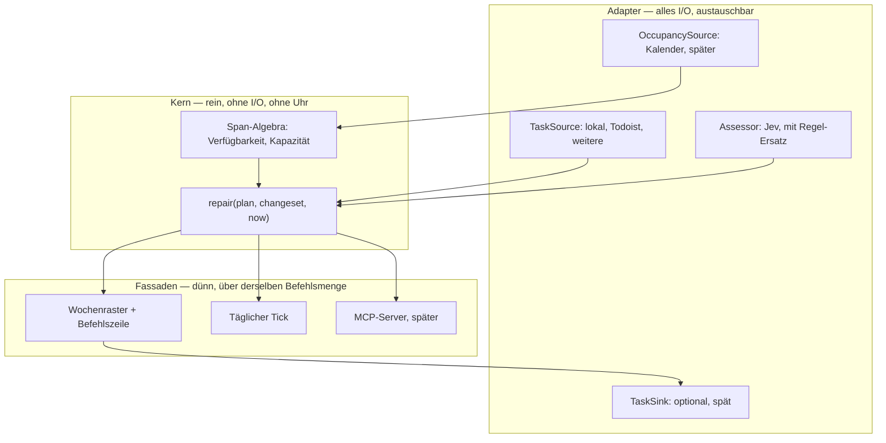

# Planungsagent — Umsetzungsplan, Revision 2

Stand: 23. September 2026. Status: Umsetzungsentwurf, noch nicht implementiert.
Revision 2 ersetzt Revision 1 vom selben Tag.

## Was sich gegenüber Revision 1 geändert hat, und warum

| Änderung | Grund |
| --- | --- |
| Ein Zeittyp `Span` ersetzt fünf Zeitentitäten | „Eine Person tut nur eine Sache gleichzeitig" wird Eigenschaft einer Funktion statt einer Regel an fünf Stellen |
| `repair(plan, changeset, now)` als einziger Einstiegspunkt; Vollplanung ist der Sonderfall | Stabilität wird die Schnittstelle, nicht ein Nice-to-have. Alltag besteht aus kleinen Eingriffen, nicht aus Neuläufen |
| Interne Änderungen: anwenden + rückgängig statt Vorschau + bestätigen | Vorschau bleibt nur für Schreibzugriffe nach außen, also für die einzige Aktion mit Wirkung außerhalb der App |
| Explizite Bedingungsleiter (hart / verletzbar / weich) | Rev 1 ließ „Reserve vs. Frist" und „Pflichtroutine vs. Frist" offen. Beide Fälle treten in der ersten echten Woche auf |
| Etappe 0: vertikaler Schnitt an einem Abend, danach Go/No-Go | Rev 1 zeigte den ersten echten Plan erst nach Etappe 5 von 7, also nach dem Großteil der Arbeit |
| Fünf Property-Tests ersetzen rund die Hälfte der Abnahmeliste | Findet Mitternacht, Zeitumstellung und Überlappung von selbst; weniger Arbeit bei besserer Abdeckung |
| Dauerschätzung geht von Programmcode an Jev | Eine Dauer aus einem Titel abzuleiten ist eine Urteilsfrage. Termine, Überschneidungen, Budgets bleiben Code |
| Manuelle Aufgabenteilung in den MVP | Ohne sie verweigert das Werkzeug genau die Aufgaben, für die man es baut |
| Ein Ergebnisfeld pro Block („geschafft?") ab Etappe 6 | Rev 1 hatte keine Rückmeldeschleife. Ohne sie verbessern sich Schätzungen nie und Überbuchung bleibt unsichtbar |
| Todoist-Schreiben wird optional und letzte Etappe | Höchstes Risiko, geringster Beitrag zum Nutzen. Die Wochenansicht allein erfüllt das Wertversprechen |
| Drei Anbieterschnittstellen statt einer; lokale Quelle zuerst | Eine Abstraktion mit einer Implementierung ist geraten. Zwei machen sie echt |
| `Assessment`-Cache stark vereinfacht | 0,042 $ pro Million Input-Token und 70–500 ms machen die Invalidierungsmatrix überflüssig |
| Aufwandsschätzung ergänzt, Rücknahme-Absätze und Modellbedarf-Spalte entfallen | Rev 1 plante Rollback ohne Versionskontrolle. `git init` ersetzt sieben Absätze |
| Paketname `planner` statt `jev_planner` | Jev füllt fünf Felder und ist austauschbar. Es sollte dem Projekt nicht den Namen geben |
| Nachtrag: Fassaden im Vergleich statt nur beschrieben, samt Begründung gegen einen autonomen Agenten | Rev 1 hatte eine Kanaltabelle, die zunächst verlorenging; die Abwägung MCP gegen Chat gegen Autonomie war nur mündlich |
| Nachtrag: Umschaltpuffer zwischen Blöcken | Fehlte in beiden Revisionen. Ein lückenlos verplanter Tag wird nicht befolgt |
| Nachtrag: Echo-Schutz bei Webhooks | Aus Rev 1 übernommen, war beim Umbau entfallen |
| `profile.md` mit eingebetteten TOML-Blöcken wird die Quelle aller Deklarationen; Naht Deklaration/Zustand definiert | Eingabeformat und Fixture-Format werden dasselbe, der Testkorpus wächst von allein, und die Formularschicht entfällt |
| Priorisierungs*politik* wird Konfiguration statt fest verdrahtet | Macht sie zum Teil des Fixtures und damit zwei Politiken auf derselben Woche vergleichbar |
| Flexible Routinen: Verbindlichkeit und Fensterhärte getrennt (`zeitraum` hart, `bevorzugt` weich), `periode` frei wählbar, benannte Tageszeiten | Rev 2 vermischte „muss stattfinden" mit „darf nur dort stattfinden". Arbeitsroutinen sind fast immer „ungefähr vormittags"; zweiwöchentlich und monatlich waren gar nicht ausdrückbar |
| Regelarten als einsteckbare Generatoren unter `core/rules/` | Die meisten gewünschten Routine-„Features" werden dadurch reine Konfiguration statt Code |
| Undo wird ein zeilenbasiertes Journal über allen berührten Zustand statt eines Plan-Schnappschusses | Ein Plan-Undo wird von der nächsten Reparatur aufgehoben, wenn der Befehl auch Aufgabendaten geändert hat |
| `TaskPart` mit stabilen IDs und Fortschrittsregeln für geteilte Aufgaben | Nach einer erledigten Sitzung war nicht festgelegt, wie viele übrig bleiben |
| Perioden: Sollfenster begrenzt die Platzierung, Dringlichkeit nur noch die Reihenfolge | Eine Dringlichkeitszahl allein verhindert keine frühe Platzierung — der gierige Einpasser nimmt trotzdem das früheste Fenster |
| Jev-Schema: `UseEnumMemberDocstrings` und `Field(description=...)` | Ein blankes `IntEnum` wird von der Integration mit `UserError` abgelehnt; die Feldbeschreibung ist die Frage |
| Export geteilter Aufgaben: nur der nächste offene Teil | Todoist hat je Aufgabe ein Termin-/Dauerpaar; mehrere Sitzungen würden sich überschreiben |
| Überschneidungs-Invariante gilt für neue Planblöcke, nicht für alle `OCCUPIES`-Spans | Ein importierter Termin während der Mittagspause ist zulässige Eingabe und ein Konflikt, kein Invariantenbruch |
| Invariante nochmals verengt: nur **neu erzeugte oder verschobene** Blöcke | Auch ein erhaltener fixierter Block kann nachträglich kollidieren, wenn später ein Termin importiert wird — sonst widerspricht die Invariante der Erhaltungsregel |
| Restdauer bei „teilweise" wird getrennt erfasst statt aus `geplant − actual` berechnet | Aufgewendete Zeit ist kein Maß für Fortschritt; die Formel konnte negativ werden. `actual` bleibt als Kalibrierungsdatum |
| Periodenlage wird deklariert (`lage`), Scheibe allein begrenzt nichts | Bei `n = 1` ist die Scheibe die ganze Periode; ob eine monatliche Routine ans Ende gehört, hängt von ihr ab und lässt sich nicht raten |
| Profilrevision an `Plan` und `UndoEntry`; erhaltene Blöcke werden gegen die aktuellen Deklarationen nachgeprüft | Betrifft nicht nur Undo: auch eine Profiländerung über den Datei-Watcher und ein alter Plan aus der Datenbank hinterlassen sonst Blöcke, die keiner Regel mehr entsprechen |
| Enum-Mixin vor dem Enum-Typ | `(IntEnum, UseEnumMemberDocstrings)` scheitert an der Klassendefinition; lokal verifiziert |
| Drei Stufen von Blöcken statt eines mehrdeutigen „erhalten"; nur Stufe 1 wird zu Konflikten, Stufe 2 wird stillschweigend neu platziert | Sonst erzeugt jede Profiländerung einen Stapel manueller Bestätigungen — genau die Arbeit, die das Werkzeug abnehmen soll |
| Drei Messgrößen für den Produktnutzen: Befolgungsquote, Korrekturaufwand, Nettozeit; keine Etappe wird automatisch betreten | Die bisherigen Prüfungen sicherten nur Vertragskonsistenz. Ohne Nutzenmaß gibt es keine Grundlage, Funktionen wieder wegzulassen |
| Geltungsbereich der Invarianten **einmal vor der Liste** statt je Punkt | Die Einschränkung war dreimal einzeln nachgetragen worden und fehlte trotzdem noch bei Invariante 2 und 6. Vor der Liste gilt sie auch für jede später ergänzte |
| Vergangene Blöcke werden nie gegen aktuelle Deklarationen nachgeprüft | Sonst wird ein korrekt gearbeiteter Gestern-Block durch eine heutige Profiländerung rückwirkend zum Konflikt — und als Kalibrierungsdatum zerstört |
| Korrekturaufwand zählt gefilterte manuelle Planänderungen, nicht `UndoEntry`-Einträge; `UndoEntry` bekommt einen Auslöser | Die rohe Anzahl hätte jedes abgehakte `MarkDone` als Korrektur gezählt |
| Jev-Streichkriterium je Feld mit eigener Vergleichsbasis | Ein unverändertes Ranking sagt nichts über den Wert der Dauerschätzung, die laut Abschnitt 6 der wichtigste Einsatz ist |

Unverändert übernommen, weil es trägt: geteilte Kapazität bei überlappenden
Fenstern, Zeitumstellung als Konflikt statt stiller Verschiebung, lokale Zeit
plus IANA-Zone für Regeln und zusätzlich UTC für Blöcke, Schutz von
Serienaufgaben des Anbieters, fester Planungszeitpunkt je Lauf,
Wochenhäufigkeit über die ganze Kalenderwoche, Aufgabentexte als Daten statt
als Anweisungen, Schlüssel nur serverseitig, Bindung an Loopback.

## 1. Produkt in einem Satz

Ein lokal laufendes Werkzeug, das Aufgaben aus beliebigen Quellen, selbst
eingetragene Routinen und das tatsächlich verfügbare Zeitbudget zu einem
Wochenraster verbindet, das man den Tag über in Sekunden korrigieren kann.

Der Nutzen entsteht nicht daraus, dass eine Maschine plant, sondern daraus,
dass die Kapazitätswahrheit sichtbar wird: Wie viel Zeit ist nach Schlaf,
Arbeitsweg, Pausen und Terminen wirklich übrig, und was passt nicht hinein.

## 2. Was das Werkzeug leistet — und was bewusst nicht

Leistet in der ersten Version:

- Routinen in einer versionierbaren Profildatei erfassen: Arbeitszeiten, Wege,
  Pausen, Schlaf, feste und flexible wiederkehrende Aktivitäten, mit groben
  Zeiträumen und Perioden von einer Woche bis zu einem Monat. Vollständig ohne
  angebundenen Kalender nutzbar.
- Einzelne Tage abweichend behandeln: Urlaub, Arzttermin, Feiertag,
  verschobener Arbeitsbeginn.
- Aufgaben aus einer lokalen Liste und aus Todoist zusammenführen.
- Ein Wochenraster mit freien Fenstern, Reserven, Konflikten und nicht
  eingeplanten Aufgaben samt Grund erzeugen.
- Den Plan über kleine Befehle korrigieren, mit Rückgängig-Stapel.
- Nach jedem Block eine Frage beantworten und den Resttag reparieren lassen.

Leistet bewusst nicht:

- Keine automatische Zerlegung großer Vorhaben. Teilen ist manuell und
  ausdrücklich: „drei Blöcke à zwei Stunden".
- Kein freies Gespräch. Eine Befehlszeile mit festen Mustern deckt den Alltag.
- Kein Mehrbenutzerbetrieb, kein Hosting, keine Authentifizierung.
- Keine beliebigen Wiederholungsregeln. Wochentage plus datierte Ausnahmen.
- Keine Transaktionsgarantie gegenüber externen Anbietern.

## 3. Erste Nutzung im Web

Der Weg, den ein Nutzer am ersten Abend geht — und gleichzeitig die
Abnahme für Etappe 0 bis 3:

1. `uv run planner` startet den Dienst auf `127.0.0.1:8765`. Kein Token,
   kein Konto, kein Einrichtungsassistent.
2. Beim ersten Start wird `profile.md` mit einem erkennbar beispielhaften
   Profil angelegt: Arbeit 09:00–17:00, Mittag 12:00–13:00, privat
   18:00–21:30, Schlaf 23:00–07:00, eine Fokuszeit, eine Sportroutine.
3. Diese Datei wird im Editor korrigiert — die eigenen Arbeitszeiten,
   Routinen, Ziele. Speichern löst über den Datei-Watcher eine Neuplanung
   aus; das Raster im Browser aktualisiert sich ohne Neuladen.
4. Aufgaben entstehen in der Befehlszeile des Rasters: `steuer 2h fr`,
   `einkauf 30m`. Oder aus Todoist, sobald der Adapter existiert.
5. Das Raster zeigt den Plan, die Reserve, und darunter was nicht
   hineinpasst und warum. Korrekturen am Plan — schieben, kürzen, fixieren,
   Vorkommen auslassen — laufen im Raster, nicht in der Datei.
6. Über den Tag: der laufende Block ist hervorgehoben. Nach seinem Ende
   eine Frage, ein Klick — der Resttag repariert sich.

Die Arbeitsteilung in Schritt 3 gegen 5 ist die Naht aus 4.8: die Datei sagt,
wie die Woche grundsätzlich aussieht; das Raster behandelt, was heute davon
abweicht.

Nach einer Woche Gebrauch steht die Frage, die zählt: **Zeigt dieses Raster
morgens einen Plan, den ich tatsächlich befolge?** Fällt die Antwort nein aus,
ist der Rest des Plans nicht das Problem.

Damit das eine Antwort und kein Gefühl wird, drei Messgrößen:

1. **Befolgungsquote** — welcher Anteil des vorgeschlagenen Plans wird
   tatsächlich umgesetzt?
2. **Korrekturaufwand** — wie viele Eingriffe sind pro Tag nötig?
3. **Nettozeit** — spart das Werkzeug *einschließlich seiner Pflege* Zeit
   gegenüber der bisherigen Planung?

In Etappe 0 werden die drei nach einer Woche von Hand beantwortet. Ab Etappe 6
lassen sich die ersten beiden aus vorhandenen Daten ableiten — die
Befolgungsquote aus `MarkDone`, der Korrekturaufwand aus dem Journal.

Die **rohe Anzahl** der `UndoEntry`-Einträge ist dafür aber unbrauchbar: jeder
Befehl schreibt einen Eintrag, `MarkDone` eingeschlossen. Zehn abgehakte Blöcke
ohne eine einzige Planänderung ergäben zehn scheinbare Korrekturen. Gezählt
werden deshalb nur **manuelle Planänderungen**: `NudgeBlock`, `ResizeBlock`,
`DropBlock`, `InsertTask`, `LockBlock`, `SetTaskField`, `Rescope`,
`DayException`, `MoveOccurrence`, `SkipOccurrence`. Nicht gezählt werden
`MarkDone` im Normalfall und alles, was der Tick oder der Datei-Watcher
ausgelöst hat. Dafür trägt jeder `UndoEntry` einen **Auslöser**
(`mensch` / `tick` / `watcher`).

Ein nicht geschaffter Block ist zwar ein Signal über die Planqualität, zählt
aber bereits in Messgröße 1 und darf nicht zusätzlich in Messgröße 2 landen —
sonst messen die beiden Größen teilweise dasselbe.

Frage 3 lässt sich nicht automatisieren und nur beantworten, wenn es einen
Vergleichswert gibt. Deshalb **vor** Etappe 0 notieren, was die bisherige
Planung an Zeit kostet — sonst ist die Frage später unbeantwortbar.

## 4. Architektur

### 4.1 Schichten



Die Regel dahinter: der Kern kennt keine Datenbank, kein HTTP, keine
Systemzeit. `now` wird hineingegeben — das ist ohnehin schon gefordert, weil
der Planungszeitpunkt je Lauf fixiert ist. Dadurch ist der Kern in
Millisekunden testbar und ohne Browser aufrufbar.

### 4.2 Der eine Zeittyp

```python
class Kind(Enum):
    OPENS    = "opens"     # öffnet Zeit für einen Bereich
    BLOCKS   = "blocks"    # entzieht Zeit einem Bereich (Urlaub)
    OCCUPIES = "occupies"  # belegt die Person, bereichsunabhängig

@dataclass(frozen=True)
class Span:
    start: datetime          # immer UTC
    end: datetime
    kind: Kind
    domain: Domain | None    # WORK | PRIVATE | None = wirkt auf alle
    source: Source           # ROUTINE EXCEPTION PROVIDER MANUAL PLAN CALENDAR
    mutable: bool
    ref: str | None          # Regel-, Vorkommens- oder Aufgaben-ID
```

Alles ist ein `Span`: Arbeitsfenster `OPENS/WORK`, Mittagspause `OCCUPIES`,
Urlaub `BLOCKS/WORK`, ein Anbietertermin mit Uhrzeit `OCCUPIES/PROVIDER`,
ein Planblock `OCCUPIES/PLAN`, später ein Kalendereintrag `OCCUPIES/CALENDAR`.

Regeln sind reine Generatoren `Rule → list[Span]` über einen Zeitraum. Eine
datierte Ausnahme ist ein `Span`, der ein Vorkommen überschattet. Ein
Kalender ist eine weitere `Source` und sonst nichts.

Verfügbarkeit ist damit Intervallalgebra über einer Menge:

```python
def free_for(spans: Iterable[Span], domain: Domain) -> list[Interval]:
    opened   = union(s for s in spans if s.kind is OPENS   and s.domain in (domain, None))
    blocked  = union(s for s in spans if s.kind is BLOCKS  and s.domain in (domain, None))
    occupied = union(s for s in spans if s.kind is OCCUPIES)
    return subtract(opened, union2(blocked, occupied))
```

Weil `occupied` bereichsunabhängig abgezogen wird, kann keine Fassung des
Codes versehentlich doppelte Kapazität erzeugen. Das war in Revision 1 eine
Regel, an die man sich erinnern musste.

### 4.3 Der eine Einstiegspunkt

```python
def repair(plan: Plan, changes: Changeset, now: datetime, ctx: Context) -> Outcome
```

`Outcome` enthält den neuen Plan, das Diff gegen den alten, die Konflikte und
die nicht eingeplanten Aufgaben mit Grund. Vollplanung ist
`repair(Plan.empty(), Changeset.all_tasks(), now, ctx)` — kein eigener Pfad.

Reparatur ist lokal: betroffener Tag plus die Blöcke, deren Bedingungen durch
die Änderung kippen. Alles andere bleibt unangetastet. Das ist der Unterschied
zwischen einer Umgebung, die das Projekt neu baut, und einer, die die Datei
neu baut, und es ist der Grund, warum sich das Werkzeug flüssig anfühlt.

Blöcke haben dabei genau **drei Stufen**. Das Wort „erhalten" allein ist
mehrdeutig und war es an dieser Stelle auch:

| Stufe | Welche Blöcke | Bei geänderten Bedingungen |
| --- | --- | --- |
| **Unantastbar** | vergangen, laufend, manuell fixiert | werden **nie** verschoben. Passen sie nicht mehr, entsteht ein sichtbarer Konflikt, den der Mensch auflöst |
| **Stabilitätsbevorzugt** | automatisch geplant, zukünftig, verschiebbar | bleiben liegen, solange nichts dagegen spricht — kippen ihre Bedingungen, werden sie **stillschweigend neu platziert**, ohne Konflikt und ohne Rückfrage |
| **Neu** | noch nicht platziert | werden eingepasst |

Der Unterschied zwischen Stufe 1 und 2 ist nicht kosmetisch. Würde auch Stufe 2
zum Konflikt statt neu platziert, erzeugte jede Profiländerung einen Stapel
manueller Aufräumarbeit: Arbeitsbeginn von 9 auf 10 verschieben und danach
fünfzehn Blöcke von Hand bestätigen. Genau das soll das Werkzeug abnehmen.
Konfliktarbeit entsteht nur dort, wo der Mensch selbst eine Festlegung
getroffen hat, die nicht mehr aufgeht.

**Nachgeprüft** gegen die aktuellen Deklarationen werden die Blöcke der Stufe 1
— aber nur, soweit sie in der **Zukunft** liegen, also künftige Fixierungen und
der noch verbleibende Teil des laufenden Blocks. Liegt einer nicht mehr in einem
erlaubten Fenster oder kollidiert er mit neu importierter Belegung, wird er zum
sichtbaren Konflikt — weder stillschweigend verschoben noch stillschweigend
behalten.

**Vergangene Blöcke werden nie nachgeprüft.** Wer gestern korrekt von 9 bis 10
gearbeitet hat, hat das getan; ein heute auf 10 Uhr gerückter Arbeitsbeginn
macht den gestrigen Block nicht rückwirkend zum Konflikt. Abgeschlossene
Intervalle werden unter der Profilrevision gelesen, unter der sie entstanden
sind — dafür steht sie am `Plan`. Geänderte Regeln betreffen Zukunft und
Restlaufzeit, nicht Historie. Das erhält auch die Kalibrierungsdaten: ein
vergangener Block ist ein Datenpunkt über den tatsächlichen Tagesverlauf und
darf nicht durch eine späteren Regeländerung zu Ausschuss werden. Das betrifft drei
Wege gleichermaßen: eine Profiländerung über den Datei-Watcher, einen älteren
Plan aus der Datenbank, und ein `Undo` über eine Profiländerung hinweg.
Deshalb trägt jeder `Plan` und jeder `UndoEntry` die **Profilrevision**, unter
der er entstand; weicht sie von der aktuellen ab, meldet die Oberfläche
„Profil hat sich seit diesem Stand geändert, `N` fixierte Blöcke sind jetzt
Konflikt" — und sagt zugleich, wie viele Blöcke der Stufe 2 automatisch neu
gelegt wurden.

Vergangene Blöcke sind Historie und gelten nicht als erledigt: ist die Aufgabe
weiter offen, darf sie genau einmal neu eingeplant werden und erscheint als
„erneut geplant".

### 4.4 Befehle — die eigentliche API

Jede Interaktion, egal über welche Fassade, ist einer dieser Befehle. Das ist
die Fläche, die später ein Sprachmodell oder ein MCP-Client bedient.

| Befehl | Wirkung |
| --- | --- |
| `CreateRule` `UpdateRule` `PauseRule` | Routine anlegen, ändern, stilllegen |
| `SkipOccurrence` `MoveOccurrence` `CompleteOccurrence` | Einzelnes Vorkommen, ohne die Serie zu ändern |
| `DayException(date, kind)` | Urlaub, frei, abweichende Arbeitszeit |
| `Rescope(date, minutes)` | „Heute habe ich nur eine Stunde" |
| `NudgeBlock(delta)` `ResizeBlock` `DropBlock` | Kleine Korrektur am Plan |
| `LockBlock` `UnlockBlock` | Gegen Neuplanung schützen |
| `InsertTask(task, day\|slot)` | Aufgabe gezielt setzen |
| `SplitTask(task, n, minutes, min_gap)` | Manuelle Teilung großer Aufgaben |
| `SetTaskField(task, field, value)` | Dauer, Bereich, Priorität korrigieren |
| `MarkDone(block, actual_minutes)` | Rückmeldeschleife und Kalibrierungsdatum |
| `Replan(horizon)` | Vollplanung als Sonderfall |

**Rückgängig.** Ein Schnappschuss nur des Plans genügt **nicht**: ändert
`SetTaskField` die Dauer von 30 auf 60 Minuten, stellt ein Plan-Undo den alten
Plan her, aber nicht die alte Dauer — die nächste Reparatur leitet den Plan aus
dem geänderten Wert neu ab und hebt das Undo wieder auf.

Deshalb: jeder Befehl läuft in **einer** SQLite-Transaktion und schreibt einen
`UndoEntry` mit den Vorwerten **aller** Zeilen, die er berührt hat — Plan,
Task-Überschreibungen, Ausnahmen, Vorkommensstatus, Teilstatus. `Undo` spielt
diese Zeilen zurück. Ein zeilenbasiertes Journal statt eines inversen
Befehlspaars pro Befehl: generisch, und es kann nichts vergessen.

Die Profildatei ist nicht Teil des Journals, weil die Anwendung sie nie
schreibt (4.8). Eine Änderung an Arbeitszeiten macht man im Editor rückgängig
oder über Git — diese Grenze fällt aus der Naht zwischen Deklaration und
Zustand von selbst heraus und ist in der Oberfläche zu benennen.

Daraus folgt aber, dass ein `Undo` über eine Profiländerung hinweg einen Plan
zurückholen kann, der unter den alten Deklarationen richtig war und unter den
neuen falsch ist — ein 9-Uhr-Block, nachdem der Arbeitsbeginn auf 10 Uhr
gerückt ist. Deshalb die Profilrevision am `UndoEntry` und die Nachprüfung
erhaltener Blöcke aus 4.3. Gesperrt wird das Undo nicht; es wird
zurückgespielt, nachgeprüft und das Ergebnis benannt.

### 4.5 Bedingungsleiter

Diese Reihenfolge ist normativ und schließt die größte Lücke aus Revision 1:

1. **Hart, nie verletzt.** Keine zwei Blöcke überlappen. Nichts beginnt vor
   `now`. Schlaf und feste Blöcke. Anbietertermine mit Uhrzeit. Manuelle
   Fixierungen.
2. **Hart, nur nach ausdrücklicher Freigabe verletzbar.** Bereichszuordnung:
   eine private Aufgabe landet nicht in Arbeitszeit, solange der Nutzer das
   Fenster nicht freigibt.
3. **Verpflichtende flexible Routinen.** Stehen über der Reserve, weichen aber
   einer unverschiebbaren Frist. Kollision wird als Konflikt mit Begründung
   angezeigt, nicht stillschweigend gelöst.
4. **Weich, in dieser Reihenfolge nachgebend.** Reserve → bevorzugte Routinen
   → Optimierung nach Zielbeitrag → Stabilität des bestehenden Plans.
5. Eine unmögliche Frist wird **gemeldet**. Sie wird nie durch Verletzen von
   Stufe 1 gelöst. Eine zu lange Aufgabe bleibt mit Grund ungeplant und
   schlägt die Teilung vor.

Der Reservewert ist `max(r × Restzeit, absoluter Tagesfloor)`. Als reiner
Prozentsatz der Restzeit schrumpft die Reserve absolut genau an den Tagen,
die schon voll sind — also dann, wenn sie gebraucht wird.

Hinweis zur globalen Reserve: bei nicht überlappenden Fenstern ist
`0,8 × (7 h + 3,5 h)` genau gleich `0,8 × 7 h + 0,8 × 3,5 h`. Die globale
Grenze bindet also nur bei Überlappung. Die Oberfläche soll das zeigen,
sonst wirkt die eingestellte Reserve im Normalfall schwächer als erwartet.

### 4.6 Algorithmus

Gieriges Einpassen mit dokumentierter Ordnung, kein Solver. Die Reihenfolge
ist **Konfiguration, nicht Code** — `[reihenfolge].schluessel` in der
Profildatei, Vorgabe `["frist", "prioritaet", "zielbeitrag", "id"]` mit der
Aufgaben-ID als stabilem Gleichstandsbrecher. Dadurch wird sie Teil des
Fixtures, und zwei Politiken lassen sich auf derselben Woche vergleichen —
genau das Experiment, mit dem sich prüfen lässt, ob der Jev-Zielbeitrag
überhaupt etwas am Plan ändert. Platzierung im frühesten passenden
zusammenhängenden Fenster des richtigen Bereichs, das Budget,
Tagesobergrenze und Umschaltpuffer einhält; bei markiertem Konzentrationsbedarf zuerst die
vordersten Stunden eines Arbeitsfensters versuchen.

Ein Solver (CP-SAT) wird erst erwogen, wenn Fixtures zeigen, dass die gierige
Ordnung schlechte Pläne erzeugt. Für eine Person mit einem Siebentagehorizont
ist das unwahrscheinlich, und die gierige Variante ist erklärbar — was für die
Begründungstexte zählt.

### 4.7 Invarianten

Die Kapazitätsseite ist von Kollisionen unberührt, weil `free_for` alle
`OCCUPIES`-Spans vor dem Abzug vereinigt — überlappende feste Blöcke werden
also einmal gezählt, nicht zweimal.

**Geltungsbereich, einmal für die ganze Liste.** Jede Invariante über Blöcke
gilt ausschließlich für in diesem Lauf **neu erzeugte oder verschobene** Blöcke
— also für Stufe 2 und 3 aus 4.3. Unantastbare Blöcke sind von allen
Blockinvarianten ausgenommen: ein fixierter Block von 10–11 Uhr bleibt stehen,
auch wenn danach ein Termin für 10:30 importiert wird oder der Arbeitsbeginn
später gerückt ist. Solche Fälle sind **ausgewiesene Konflikte**, die der Mensch
auflöst (Fixierung lösen, verschieben, verwerfen), nie ein Invariantenbruch und
nie eine stillschweigende Korrektur des Schedulers. Dasselbe gilt für
Kollisionen zwischen Spans anderer Herkunft.

Dieser Satz steht absichtlich **vor** der Liste und nicht in einzelnen
Punkten: er gilt damit auch für jede Invariante, die später ergänzt wird. Die
Einschränkung dreimal einzeln nachzutragen war der Fehler der Vorfassungen.

1. Kein `OCCUPIES/PLAN`-Span überlappt einen anderen `OCCUPIES`-Span. Das ist
   die Garantie des Schedulers.
2. Jeder Planblock liegt vollständig in einem für seinen Bereich freien
   Intervall.
3. Summe neuer flexibler Blöcke je Bereich ≤ Bereichsbudget, und über die
   Vereinigung ≤ globales Budget.
4. `repair(repair(p, c), ∅) == repair(p, c)` — Reparatur ist idempotent.
   Gilt unabhängig vom Geltungsbereich, weil sie keine Blockeigenschaft ist.
5. Kein neuer Block beginnt vor `now`.
6. Zwischen zwei Planblöcken verschiedener Bezüge liegt mindestens
   `switch_buffer`, sofern keine der Ausnahmen aus Abschnitt 5 greift.

Ein Property-Test muss deshalb zwei Mengen unterscheiden können: was dieser
Lauf angefasst hat, und was er vorgefunden hat. `Outcome` liefert beides über
das Diff, also ist das keine zusätzliche Buchführung.

### 4.8 Deklaration und Zustand

Zwei Datenarten, und nur eine gehört in eine Datei. Die Naht dazwischen ist
die Stelle, an der selbstgebaute Werkzeuge dieser Art üblicherweise kippen.

| | Deklaration → `profile.md` | Zustand → SQLite |
| --- | --- | --- |
| Wer schreibt | nur der Mensch | nur die Anwendung |
| Änderungsrate | monatlich | minütlich |
| Inhalt | Fenster, feste Blöcke, Routinen, Ziele mit Gewicht, Reserve, Puffer, Priorisierungspolitik | Vorkommensstatus, Planversionen, Blöcke, `MarkDone`-Ergebnisse, Bewertungen, Undo-Schnappschüsse, Schreiboperationen |

**Regel: die Anwendung liest die Profildatei und schreibt sie nie.** Einseitig.
Sobald die Maschine zurückschreibt, gehen Kommentare verloren, es entsteht
Formatierungsrauschen, es gibt Konflikte mit dem offenen Editor, und der
Undo-Stapel wird unzuverlässig, weil zwei Wahrheiten existieren. Editiert das
Raster später Routinen, bekommt es einen engen, geprüften Schreiber; bis dahin
zeigt es Routinen als „siehe `profile.md`".

Bei der Priorisierung verläuft die Naht mitten durch: die **Politik** —
Schlüsselreihenfolge, Zielgewichte — ist Deklaration und steht in der Datei.
Die **Priorität einer einzelnen Aufgabe** gehört zur Aufgabe, also zur Quelle
oder zu lokalen Task-Metadaten, sonst müsste die Maschine die Datei schreiben.

Ausnahmen sind der Grenzfall, weil sie dokumentiert *und* per Befehl erzeugt
werden. Regel ohne Abgleich-Chaos: Ausnahmen dürfen in der Datei stehen, und
dann besitzt die Datei diese Daten — ein Befehl für ein dort deklariertes
Datum wird mit Verweis auf die Datei abgelehnt. Alles Spontane erzeugt der
Befehl und landet in der Datenbank.

Der Zustand in SQLite, gegenüber Revision 1 zusammengeschrumpft, weil `Span`
fünf Entitäten ersetzt und der Bewertungscache nur noch Reproduzierbarkeit
sichert. `Preferences` und `Rule` sind ab jetzt geladene Abbilder der
Profildatei, keine editierbaren Tabellen:

| Objekt | Wesentliche Daten |
| --- | --- |
| `Preferences` | Zeitzone, Wochenbeginn, Ziele, Tagesobergrenzen, Reserveanteil und -floor, Umschaltpuffer, Konzentrationspräferenz |
| `Rule` | ID, Art, Bereich, Wochentage, harte und bevorzugte Zeiträume, IANA-Zone, Dauer, Periode, Anzahl, Mindestabstand, Verbindlichkeit, Gültigkeit |
| `Exception` | Regel- oder Vorkommensbezug, Datum, auslassen oder ersetzen, Ersatzfenster |
| `Occurrence` | ID, Regel-ID, lokale Periode, Status offen/erledigt/ausgelassen |
| `Task` | Quellen-ID, Titel, Container, Bereich, Dauer, Dauerquelle, Priorität, Frist, frühester Start, Abhängigkeiten, Serienmarker, Änderungsmarker, Teilungsvorgabe |
| `Plan` | Version, Planungszeitpunkt, **Profilrevision**, Horizont, Blöcke, Konflikte, ungeplante Aufgaben mit Grund |
| `Block` | Bezug auf Aufgabe, **Aufgabenteil** oder Vorkommen, Start/Ende, Herkunft, fixiert, **Ergebnis** (offen/geschafft/nicht/teilweise + tatsächliche Minuten) |
| `TaskPart` | `task:part/k`, Aufgaben-ID, Index `k` von `n`, geplante Dauer, Restdauer, Status offen/laufend/erledigt |
| `UndoEntry` | Befehl, **Auslöser** (`mensch`/`tick`/`watcher`), Zeitpunkt, **Profilrevision**, Vorwerte aller berührten Zeilen aus `Plan`, `Task`, `TaskPart`, `Exception`, `Occurrence` |
| `Assessment` | Aufgaben-ID, Inhaltshash, Schemahash, Modellversion, Antworten, Confidence, Zeitpunkt |
| `WriteOp` | nur ab Etappe 7: Planversion, Quellen-ID, Änderung, Vorwert, Befehls-UUID, Status |

Das Feld `Block.Ergebnis` ist die wichtigste Ergänzung gegenüber Revision 1.
Es ist gleichzeitig Rückmeldeschleife, Kalibrierungsdatensatz für
Dauerschätzungen und Auslöser für die Reparatur des Resttags.

## 5. Routinen, Verfügbarkeit, Kapazität

### Drei Arten von Regeln

| Art | Beispiel | Als `Span` |
| --- | --- | --- |
| Verfügbarkeitsfenster | Mo–Fr 09:00–17:00 arbeiten | `OPENS/WORK` |
| Fester Block | Mittagspause, Arbeitsweg, Schlaf, festes Meeting | `OCCUPIES` |
| Flexible Routine | 3× pro Woche 45 min Sport abends; 2 h Fokuszeit wöchentlich vormittags; Monatsabschluss | erzeugt `OCCUPIES/PLAN` beim Planen |

Ein Arbeitsfenster öffnet Zeit für berufliche Aufgaben und gibt sie nicht für
private frei. Für private Aufgaben werden eigene Fenster erfasst. Zeiten
außerhalb aller passenden Fenster bleiben unverplant.

Flexible Vorkommen behalten ihre Identität bei Verschiebung. Jev verändert
weder Verbindlichkeit noch Zeitraum einer Routine.

### Zeitraum, Härte und Verbindlichkeit

Revision 2 hatte hier zwei Dinge vermischt: *ob* eine Routine stattfinden muss
und *wo* sie stattfinden darf. Das sind zwei unabhängige Achsen, und flexible
Routinen brauchen beide getrennt — besonders für Arbeitsroutinen, die fast
immer „ungefähr vormittags, aber notfalls auch anders" sind.

**Achse 1 — Verbindlichkeit.** `verbindlich = true` heißt: die Routine muss im
Zeitraum stattfinden, sie reserviert vor optionalen Aufgaben (Bedingungsleiter
Stufe 3). `false` heißt: sie darf mit sichtbarer Begründung ungeplant bleiben.

**Achse 2 — Härte des Zeitfensters.** `zeitraum` ist hart: außerhalb wird die
Routine nicht platziert. `bevorzugt` ist weich: dort wird zuerst gesucht, bei
Misserfolg überall im erlaubten Bereich. Beides zusammen ergibt:

| | `zeitraum` (hart) | `bevorzugt` (weich) |
| --- | --- | --- |
| `verbindlich = true` | Muss stattfinden, nur dort. Kein Platz → Konflikt mit Grund | Muss stattfinden, dort zuerst. Kein Platz dort → irgendwo im erlaubten Bereich |
| `verbindlich = false` | Soll stattfinden, nur dort. Kein Platz → ungeplant mit Grund | Soll stattfinden, dort zuerst. Die nachgiebigste Form |

**Achse 3 — Zeitraum der Häufigkeit.** `periode` ist `woche` (Vorgabe),
`zwei_wochen`, `monat` oder ein Datumsbereich. `anzahl` zählt innerhalb dieser
Periode. Das alte `pro_woche = 3` ist `periode = "woche", anzahl = 3`.

Grobe Zeitangaben werden als benannte Tageszeiten geschrieben, einmal definiert
und überall referenziert — `zeitraum = ["vormittag"]` statt `"09:00-12:00"`.
Das macht das Profil lesbar und die Befehlszeile ebenfalls (`sport abends`).

### Perioden länger als der Horizont

Die Häufigkeit bezieht sich auf die laufende Periode gemäß eingestelltem
Wochenbeginn. Erledigte und erhaltene zukünftige Vorkommen außerhalb des
sichtbaren Horizonts zählen mit; nur fehlende Einheiten werden eingeplant.
Dieselbe Regel galt in Revision 2 schon für die Kalenderwoche — sie
verallgemeinert sich auf beliebige Perioden, das ist der einfache Teil.

Neu ist die Frage, *wann* innerhalb einer langen Periode geplant wird. Wer
monatliche Routinen einfach früh platziert, bekommt jeden Ersten überfüllt.

Eine Dringlichkeitszahl allein löst das **nicht**: sie beeinflusst die
Reihenfolge, nicht die Platzierung. Der gierige Einpasser nimmt das früheste
passende Fenster, also landet der verpflichtende Monatsabschluss trotz
niedriger Dringlichkeit am Ersten, wenn dort 90 Minuten frei sind. Die
Platzierung muss also selbst begrenzt werden.

Regel: Einheit `k` von `n` bekommt eine **Periodenscheibe** durch gleichmäßige
Teilung — `[start + (k−1)/n · P, start + k/n · P]`. Innerhalb der Scheibe
bestimmt `lage` das **Sollfenster**:

| `lage` | Sollfenster in der Scheibe | Beispiel |
| --- | --- | --- |
| `egal` (Vorgabe) | die ganze Scheibe | Lernzeit — Hauptsache, sie findet statt |
| `frueh` | erstes Drittel | Wochenplanung |
| `mitte` | mittleres Drittel | — |
| `spaet` | letztes Drittel | Monatsabschluss, Wochenrückblick |

Das Sollfenster wirkt wie `bevorzugt`: dort zuerst, außerhalb nur, wenn es dort
keinen Platz gibt. Dieselbe Maschinerie wie bei den Tageszeiten, kein neuer
Mechanismus.

`lage` ist nötig, weil die Scheibe allein nichts begrenzt: bei `n = 1` ist sie
die ganze Periode, und der gierige Einpasser nimmt dann wieder den Ersten.
Welche Lage richtig ist, hängt von der Routine ab und lässt sich nicht raten —
ein Monatsabschluss gehört ans Monatsende, eine monatliche Terminvorbereitung
nicht. Deshalb wird es deklariert statt fest eingebaut.

Die Dringlichkeit `offene Einheiten / verbleibende erlaubte Tage` steuert dann
nur noch die Reihenfolge unter den zulässigen Kandidaten: gegen Periodenende
steigt sie, und die Einheit rückt vor optionale Aufgaben. Bei
`periode = "woche"` und `n = 1` ist das Sollfenster die ganze Woche, also
dasselbe Verhalten wie bisher.

### Routinen als einsteckbare Regelarten

Im `Span`-Modell ist jede Regelart nur ein reiner Generator
`generate(rule, periode, tz) -> list[Span]`. Eine neue Art hinzuzufügen heißt
also: ein Modul unter `core/rules/` plus ein Schemaeintrag im Profil. Der
Scheduler ändert sich nicht, weil er ausschließlich `Span`-Mengen sieht. Die
Profildatei ist die Registrierung.

Folge: die meisten „Features", die man sich für Arbeit wünscht, sind schon
heute reine Konfiguration und kein Code —

| Wunsch | Ausdruck |
| --- | --- |
| Zwei Stunden ununterbrochene Fokuszeit pro Woche, möglichst vormittags | `anzahl = 1`, `dauer = "2h"`, `bevorzugt = ["vormittag"]`, `verbindlich = true` |
| Feste Zeit für E-Mail und Verwaltung, damit sie nicht alles frisst | `anzahl = 5`, `dauer = "30m"`, `zeitraum = ["nachmittag"]` |
| Wochenrückblick freitags | `tage = ["fr"]`, `anzahl = 1`, `bevorzugt = ["nachmittag"]` |
| Monatsabschluss | `periode = "monat"`, `anzahl = 1`, `lage = "spaet"`, `verbindlich = true` |
| Backlog aufräumen jede zweite Woche | `periode = "zwei_wochen"`, `anzahl = 1`, `verbindlich = false` |
| Lernzeit zweimal wöchentlich, wenn Platz ist | `anzahl = 2`, `bevorzugt = ["abend"]`, `verbindlich = false` |

Erst etwas, das sich nicht als Dauer plus Häufigkeit plus Zeitraum ausdrücken
lässt, braucht einen neuen Generator.

### Das Profil als Datei

Routinen, Fenster, Ziele und Priorisierungspolitik stehen in einer
menschlich editierbaren Datei, nicht in Formularen. Format: `profile.md` mit
eingebetteten ` ```toml `-Blöcken. Der Loader zieht die Blöcke heraus, hängt
sie aneinander und parst einmal mit `tomllib` aus der Standardbibliothek.

Warum so: TOML ist typsicher und ohne Abhängigkeit; YAML braucht
Anführungszeichen um Uhrzeiten und hat Umwandlungsfallen. Die
Markdown-Hülle erlaubt Prosa neben der Konfiguration — *warum* die Zeiten so
sind, was sich im März geändert hat. Das ist in sechs Monaten der Teil, den
man braucht. Reines `profile.toml` ist die Rückfallebene, wenn die
Editor-Unterstützung für eingebettete Blöcke störend ist.

Der wichtigste Nebeneffekt: **Eingabeformat und Fixture-Format sind dasselbe.**
Jedes Problem aus dem Alltag wird durch Kopieren zum Testfall, und der
Testkorpus wächst von allein statt gepflegt zu werden.

````markdown
# Mein Wochenprofil

Stand Januar 2026. Dienstag Homeoffice, deshalb kein Arbeitsweg.

```toml
[basis]
zeitzone       = "Europe/Berlin"
wochenbeginn   = "montag"
reserve        = 0.2
reserve_floor  = "30m"
umschaltpuffer = "10m"

[tageszeiten]                     # grobe Zeiträume, einmal benannt
vormittag  = "09:00-12:00"
nachmittag = "13:00-17:00"
abend      = "18:00-21:30"

[[fenster]]                       # OPENS
bereich = "arbeit"
tage    = ["mo","di","mi","do","fr"]
von     = "09:00"
bis     = "17:00"

[[fest]]                          # OCCUPIES
name = "Schlaf"
tage = ["mo","di","mi","do","fr","sa","so"]
von  = "23:00"
bis  = "07:00"

[[fest]]
name = "Arbeitsweg"
tage = ["mo","mi","do","fr"]      # Di Homeoffice
von  = "08:30"
bis  = "09:00"

[[routine]]                       # weiches Fenster, verbindlich
name        = "Fokuszeit"
bereich     = "arbeit"
dauer       = "2h"
periode     = "woche"
anzahl      = 1
bevorzugt   = ["vormittag"]
verbindlich = true

[[routine]]                       # hartes Fenster, nicht verbindlich
name           = "Sport"
bereich        = "privat"
dauer          = "45m"
periode        = "woche"
anzahl         = 3
zeitraum       = ["abend"]
max_pro_tag    = 1
mindestabstand = "1d"
verbindlich    = false

[[routine]]                       # ein Habit ist nur anzahl = 7
name        = "Tagebuch"
bereich     = "privat"
dauer       = "10m"
periode     = "woche"
anzahl      = 7
bevorzugt   = ["abend"]
verbindlich = true

[[routine]]                       # längere Periode, ans Periodenende
name        = "Monatsabschluss"
bereich     = "arbeit"
dauer       = "90m"
periode     = "monat"
anzahl      = 1
lage        = "spaet"
verbindlich = true

[[ziel]]
name    = "Buch fertigschreiben"
gewicht = 3
bis     = "2026-12-31"

[reihenfolge]                     # Politik, nicht Einzelaufgaben
schluessel           = ["frist", "prioritaet", "zielbeitrag", "id"]
konzentration_zuerst = true
```
````

Validierung über Pydantic, Fehlermeldungen **mit Zeilennummer** — das ist die
Bedienbarkeit einer Konfigurationsdatei. Ein Datei-Watcher plant beim Speichern
neu: Datei sichern im Editor, Raster aktualisiert sich. Das kostet fast nichts
und ist der flüssigste Teil des ganzen Werkzeugs.

Bewusst in Kauf genommen: eine Konfigurationsdatei macht das Werkzeug bis auf
Weiteres entwicklerfreundlich statt allgemein benutzbar. Für eine Person mit
Editor und Git ist das strikt besser als jede Oberfläche, die in dieser
Zeit entstehen könnte. Umkehrbar, sobald das Raster einen Schreiber bekommt.

### Das Beispielprofil als Fixture

Kein angenommener Tagesablauf, sondern das Fixture, gegen das Etappe 1 und 2
laufen — die Datei oben, plus: Mittag 12:00–13:00; Weg zusätzlich 17:00–17:30;
privat Mo–Fr 18:00–21:30.

Daraus: nach Mittag sieben Stunden Arbeitszeit, Reserve senkt das
Aufgabenbudget auf 5 h 36 min. Das Budget allein garantiert keinen Platz —
jede Aufgabe muss in ein ausreichend großes zusammenhängendes Fenster passen.
Ohne Teilung ist damit alles über vier Stunden beruflich unplanbar, weshalb
`SplitTask` zum MVP gehört.

### Geteilte Aufgaben

`SplitTask(task, n, minutes, min_gap)` erzeugt `n` **Teile** mit stabilen IDs
`task:part/1` bis `task:part/n` und je eigenem Status. Ohne diese Teile wäre
nach einer erledigten Sitzung einer 3×2h-Aufgabe nicht festgelegt, wie viele
übrig sind — die allgemeine Wiederholungsregel („offene Aufgabe aus einem
vergangenen Block darf einmal neu geplant werden") gibt darauf keine Antwort.

- Eingeplant werden nur **offene** Teile. Verbleibend ist `n` minus erledigte.
- Ein laufender Teil belegt Zeit und wird nicht neu eingeplant.
- `MarkDone(teil, teilweise, actual, rest)` lässt den Teil **offen**. Die
  Restdauer wird **getrennt erfasst**, nicht aus `geplant − actual` berechnet:
  aufgewendete Zeit ist kein Maß für Fortschritt. 120 Minuten geschätzt, 150
  gearbeitet und trotzdem nicht fertig ergäbe sonst −30 Minuten; und selbst
  bei 90 gearbeiteten Minuten können 200 übrig sein. Fehlt `rest`, gilt die
  ursprünglich geplante Dauer des Teils weiter, sichtbar als Schätzung.
  `n` bleibt konstant, es entstehen keine neuen Teile im Nachhinein.
- `actual` wird trotzdem gespeichert, aber ausschließlich als
  Kalibrierungsdatum: „120 geschätzt, 150 gebraucht, noch nicht fertig" ist
  genau der Datenpunkt, der eine systematisch optimistische Schätzung zeigt.
- Teile erben Frist, Bereich und Priorität von der Aufgabe. `min_gap` gilt
  zwischen Teilen und schlägt den allgemeinen Umschaltpuffer.
- Wird die Quellaufgabe erledigt, verfallen alle offenen Teile.
- Ein erneutes `SplitTask` mit anderem `n` ersetzt nur die offenen Teile;
  erledigte bleiben gezählt.

### Umschaltpuffer

Ein Tag aus lückenlos aneinandergereihten Blöcken ist ein Plan, den niemand
ausführt. `Preferences.switch_buffer` (Vorschlag: 10 Minuten) ist der
Mindestabstand zwischen zwei aufeinanderfolgenden Planblöcken **verschiedener**
Bezüge. Er gilt nicht

- zwischen Teilblöcken derselben Aufgabe aus `SplitTask`, wenn dort ein
  eigener Mindestabstand gesetzt ist — der gewinnt,
- gegen feste Blöcke, die selbst Pause oder Weg sind,
- an den Rändern eines Verfügbarkeitsfensters.

Der Puffer ist eine Bedingung im Einpassen, kein eigener `Span`: er verkleinert
die nutzbaren freien Intervalle und verbraucht damit implizit Kapazität. Das
ist gewollt — ein Tag mit vielen kleinen Aufgaben soll sich in der Rechnung
teurer anfühlen als einer mit zwei langen Blöcken.

### Zeit und Zeitzonen

Regeln in lokaler Zeit plus IANA-Zone, konkrete Blöcke zusätzlich als UTC.
Fenster über Mitternacht werden unterstützt. Bei der Zeitumstellung gilt:
nicht existierende und mehrdeutige lokale Uhrzeiten werden als Konflikt
markiert und vor dem Einplanen aufgelöst, nicht stillschweigend verschoben.
Reisen über Zeitzonen sind außerhalb des Umfangs.

### Ohne Kalender

Ein Fenster bedeutet „laut Routine verfügbar". Nicht eingetragene Meetings
sind unbekannt. Die Oberfläche zeigt diese Annahme; die Reserve federt
ungeplante Arbeit ab. Ein Kalender ergänzt später nur `OCCUPIES`-Spans einer
weiteren `Source`; kein Kalender bleibt ein unterstützter Normalfall.

## 6. Jev: Fähigkeitsgrenze und Einsatz

### Verifizierte Grenzen

Quelle: `docs.typesafe.ai`, Pydantic-AI-Integration, Cloudflare-Modellseite.
Stand September 2026, bei Umsetzung erneut prüfen.

| | |
| --- | --- |
| Request | Ein `state` (String oder strukturiertes Objekt) plus beliebig viele **unabhängige** `questions` |
| Antworttypen | `Choice` (Einfachauswahl + Verteilung + confidence), `Score` (IntEnum-Rubrik + Verteilung + confidence), `Noul` (Wahrscheinlichkeit 0–1, **kein** confidence) |
| Limits | 255 Optionen je Frage; `state` ≤ 32k Token; `state` + `questions` ≤ 64k Token |
| Feldtypen ja | bool, Literal/Enum, begrenzte Floats 0–1, IntEnum-Rubriken, verschachtelte Modelle, Optionslisten |
| Feldtypen **nein** | `str`, unbegrenzte Zahlen, `datetime`, Dicts, Bilder, Audio, Dokumente |
| Kann **nicht** | Text erzeugen (`supports_text_output=False`), Streaming, Tool-Use, Revision |
| Kann **nicht** | Ein Feld darf nicht von der Antwort eines anderen Feldes abhängen |
| Kosten, Latenz | 0,042 $ je Million Input-Token, Output unberechnet; 70–500 ms |

Vier Konsequenzen für dieses Produkt:

- **Jev ist ein Sensor, kein Planer.** Jede Verwendung ist: eine Frage, ein
  typisierter Wert pro Aufgabe, und Code rechnet oder sortiert damit.
- **Jev extrahiert nichts.** Kein `str`, keine unbegrenzten Zahlen, kein
  `datetime` heißt: keine Dauer in Minuten, kein Datum. Dauer geht nur als
  IntEnum-Rubrik über selbst definierte Buckets.
- **Jev schreibt keine Erklärungen.** Begründungen entstehen als Templates
  über gespeicherte Regeln und Faktoren. Das ist keine Vorsichtsmaßnahme,
  sondern eine Modelleigenschaft.
- **Abhängige Fragen brauchen zwei Requests.** „Ist das ein Projekt?" und
  daraufhin „in wie viele Sitzungen?" gehen nicht in einem Aufruf.

### Die fünf Felder

Ein Request pro Aufgabe, alle Fragen gemeinsam. `state` ist die Aufgabe plus
ein Ausschnitt aus Zielen und Präferenzen als strukturiertes Objekt.

Wichtig: die Integration **lehnt ein blankes `IntEnum` ab** — „a bare
`Literal[0, 1, 2]` or a plain `IntEnum` is a `UserError`: the levels are there,
but nothing says what they mean". Rubrikstufen brauchen Beschreibungen über
`UseEnumMemberDocstrings`, und die **Feldbeschreibung ist die Frage**, die Jev
gestellt bekommt. Der Mixin steht dabei **vor** dem Enum-Typ — `(IntEnum,
UseEnumMemberDocstrings)` scheitert schon an der Klassendefinition mit
`TypeError: new enumerations should be created as EnumName([mixin_type, ...]
[data_type,] enum_type)`.

```python
class DurationBucket(UseEnumMemberDocstrings, IntEnum):   # Mixin zuerst
    UNTER_15 = 0
    """Weniger als 15 Minuten, eine Kleinigkeit zwischendurch."""
    BIS_30 = 1
    """15 bis 30 Minuten."""
    BIS_60 = 2
    """30 bis 60 Minuten."""
    BIS_120 = 3
    """Eine bis zwei Stunden, braucht einen zusammenhängenden Block."""
    UEBER_120 = 4
    """Mehr als zwei Stunden, sollte in Sitzungen geteilt werden."""

class TaskAssessment(BaseModel):
    domain: Literal["arbeit", "privat", "unklar"] = Field(
        description="Gehört diese Aufgabe in den beruflichen oder privaten Bereich?")
    duration: DurationBucket = Field(
        description="Wie lange braucht eine geübte Person für diese Aufgabe?")
    is_project: bool = Field(                              # Noul
        description="Ist diese Aufgabe zu groß, um in einer Sitzung erledigt zu werden?")
    blocked: bool = Field(                                 # Noul
        description="Wartet diese Aufgabe auf etwas, das noch nicht erledigt ist?")
    goal_fit: GoalFit = Field(                             # Score-Rubrik, ebenfalls mit Docstrings
        description="Wie stark trägt diese Aufgabe zu den angegebenen Wochenzielen bei?")
```

Weil die Feldbeschreibungen die Fragen **sind**, ist „versionierte Fragen"
gleichbedeutend mit dem Schema — der `schema_hash` im Cacheschlüssel deckt
Fragenänderungen also automatisch ab.

Nach Wert sortiert:

1. **Dauer.** Der wichtigste Einsatz, weil Dauer der Input ist, den das System
   braucht und den der Nutzer nicht liefert. Ersetzt den unsichtbaren
   Standardwert aus Revision 1 durch eine kalibrierte Schätzung mit
   sichtbarem Unsicherheitszustand.
2. **Bereich.** Container- und Label-Zuordnung deckt gepflegte Projekte ab;
   Jev deckt den Rest und den Eingangskorb. Niedrige Confidence → einmal
   fragen, Antwort dauerhaft als Zuordnung speichern. Jede Frage einmal.
3. **`is_project`.** Auslöser für den Teilungsvorschlag. Adressiert direkt das
   Problem, dass der MVP sonst die wichtigen Aufgaben verweigert.
4. **`goal_fit`.** Gleichstandsbrecher hinter Frist und Priorität, kein Treiber.
5. **`blocked`.** Badge am Block, nie Scheduler-Bedingung.

Nicht für Jev: Zeitfensterwahl, Reihenfolge des Backlogs, Fristen,
Wiederholungen, Überschneidungen, Budgets, Spracheingabe, Erklärungstexte.

### Confidence-Politik

Dokumentierte Richtwerte, an eigenen Beispielen zu kalibrieren: ≥ 0,9 still
verwenden, 0,5–0,9 verwenden und als Schätzung markieren, < 0,5 nicht
verwenden und nachfragen. Confidence ist die Konzentration der Verteilung,
keine garantierte Fehlerquote.

Feinheit für geordnete Skalen: Nachbarbuckets sind ähnlich. Eine flache
Verteilung über `BIS_60` und `BIS_120` ist niedrige Confidence, aber eine
brauchbare Antwort — den konservativeren Bucket nehmen. Also die Verteilung
nutzen, nicht nur den Confidence-Skalar. Bei `Choice` über den Bereich gilt
das nicht: flach heißt dort wirklich unklar.

### Umsetzung

`TypeSafeModel` aus Pydantic AI, die Fragen sind das Pydantic-Modell oben.
Damit ist der Adapter im Kern diese Klasse plus ein Aufruf, und Versionierung
ist ein Hash über das Schema. Der Stack wird durchgehend typisiert: FastAPI →
Pydantic → Pydantic AI → Jev.

80 Aufgaben nebenläufig mit Grenze 8–16 gleichzeitig: wenige Sekunden kalt,
danach nur neue und geänderte Aufgaben, Kosten im Bereich von Bruchteilen
eines Cents. Nicht das ganze Backlog in einen `state` packen, obwohl die 32k
Token es erlauben — die unabhängige Auswertung je Zustand ist gerade das
Argument des Modells.

Cache auf `(task_id, content_hash, schema_hash, model_version)` für
Reproduzierbarkeit, nicht für Kosten. Keine Invalidierungsmatrix bei
Zieländerungen: einfach neu fragen.

Ausfallverhalten: Regel-Ersatzsortierung nach Frist, Nutzerpriorität und
Aufgaben-ID, Dauer auf Standardwert, Bereich aus Container-Zuordnung oder
„unklar". Eine markierte Vorschau bleibt möglich. Diese Ersatzsortierung ist
gleichzeitig die Vergleichsbasis: sieht man keinen Unterschied zum
Jev-Ranking, ist der Zielbeitrag entbehrlich.

Prüfung: Fixture aus rund 50 Aufgaben mit erwarteten Buckets als Snapshot,
Abweichung ist ein Testfehler. Keine manuelle Live-Bewertung.

## 7. Aufgabenquellen: Todoist und danach

### Drei Schnittstellen statt einer

Revision 1 hatte eine Anbieterschnittstelle, die Lesen und Schreiben vermischt.
Getrennt:

```python
class TaskSource(Protocol):      # Pflicht
    def fetch(self, since: str | None) -> tuple[list[Task], str]: ...

class TaskSink(Protocol):        # optional, nicht jede Quelle kann schreiben
    def apply(self, ops: list[WriteOp]) -> list[OpResult]: ...

class OccupancySource(Protocol): # Kalender, und Termine anderer Quellen
    def busy(self, start: datetime, end: datetime) -> list[Span]: ...
```

Der Vertrag je Aufgabe: stabile ID, Titel, Container, Fälligkeit (Datum oder
Zeitpunkt), Frist getrennt von Fälligkeit, Dauer, Priorität, Erledigungsstand,
**opaker** Serienmarker (nur „ist Serie", die Regel nicht nachmodellieren),
Änderungsmarker, Labels.

**Die lokale Quelle kommt zuerst, Todoist zweitens.** Eine Abstraktion mit
einer Implementierung ist geraten; zwei machen sie echt. Zudem ist das
Werkzeug damit am ersten Abend ohne Token nutzbar.

### Kandidaten

Todoist ist in dieser Session geprüft. Die übrigen Zeilen sind Einschätzung
und vor einer Umsetzung gegen die jeweilige Referenz zu prüfen.

| Quelle | Fälligkeit | Frist getrennt | Dauer | Änderungsmarker | Eignung |
| --- | --- | --- | --- | --- | --- |
| Lokal (eigene DB) | ja | ja | ja | eigen | Referenzimplementierung, Etappe 0 |
| Todoist | Datum und Uhrzeit | ja | ja, kontoabhängig | kein ETag; Sync-Token und `updated_at` prüfen | sehr gut, erste externe Quelle |
| CalDAV / VTODO (Nextcloud, iCloud-Erinnerungen, Thunderbird) | `DUE` | nein | `DURATION` | HTTP-ETag | gut und herstellerneutral; ETag macht Schreiben sicherer als bei Todoist |
| Microsoft To Do / Graph | `dueDateTime` | nein | nein | ETag | gut für Arbeitskontext |
| Linear | `dueDate` | nein | Schätzpunkte | `updatedAt` | gut für Entwicklerarbeit, Punkte→Zeit zuordnen |
| Jira | `duedate` | nein | `timeestimate` | `updated` | brauchbar |
| Google Tasks | nur Datum | nein | nein | etag | schwach, aber trivial |
| GitHub Issues | keine | nein | nein | `updated_at` | nur als terminloser Backlog |
| Notion | Property | Property | Property | `last_edited_time` | flexibel, braucht Feldzuordnung je Workspace |
| `todo.txt` / Markdown-Checkboxen | `due:` | nein | nein | Dateizeit | ohne Anmeldung, für lokal orientierte Nutzer |

Ein Kalender ist **keine** Aufgabenquelle, sondern eine Belegungsquelle. Die
Trennung ist der Grund, warum die spätere Kalenderanbindung am `Span`-Modell
nichts ändert.

### Strategische Einordnung

Todoist hat inzwischen selbst Kalenderansicht und Zeitblöcke. Der
Unterschied dieses Werkzeugs ist nicht die Ansicht, sondern die Verbindung
aus mehreren Aufgabenquellen, eigenen Routinen und einer ehrlichen
Kapazitätsrechnung. Genau das kann kein einzelner Anbieter liefern. Zwei
Quellen ab Etappe 4 sind daher nicht nur Flexibilität, sondern das
eigentliche Argument des Produkts.

### Todoist im Detail

- API v1, Cursor-Pagination, alle Seiten verarbeiten. REST rund 450 Requests
  je 15 Minuten, Sync 50–200 je Minute abhängig vom Plan; bei Umsetzung
  gegen die Referenz prüfen.
- **Sync-API statt REST wählen**, sobald geschrieben wird: `sync_token` für
  inkrementelles Lesen und Befehls-UUIDs mit Idempotenzgarantie. Damit sind
  Wiederanlauf ohne Doppeleffekt und „Timeout mit unbekanntem Ergebnis"
  durch Fremdcode erledigt, nicht durch eigenen.
- Todoist dokumentiert **kein** ETag und keine Version. „Erwarteter
  Änderungsstand" muss daher aus einem Feldvergleich beim Nachlesen gebaut
  werden. Keine Transaktionsgarantie behaupten.
- `durations` erscheint als Workspace-Feature-Flag. Ob Dauer überhaupt
  geschrieben werden kann, ist kontoabhängig und vor Etappe 7 zu klären.
  Dauer ist in Todoist zudem nur zusammen mit einer Uhrzeit sinnvoll.
- Serienaufgaben werden angezeigt, aber nicht umverteilt und nicht
  geschrieben. Nur das gelieferte aktuelle Vorkommen zählt; die Oberfläche
  weist auf die unvollständige Seriensicht hin. Keine Doppelmodellierung
  gegen lokale Routinen.
- Termin mit Uhrzeit gilt als fixiert. Bekannte Dauer belegt den Zeitraum;
  fehlende Dauer erzeugt einen sichtbar geschätzten Block. Ein Datum ohne
  Uhrzeit belegt keinen erfundenen Zeitblock.
- Schlüssel nur serverseitig aus Umgebungsvariablen. Nicht in Beispieldaten,
  Quellcode, Browserantworten oder Logs.

## 8. Verpackung: Weboberfläche, Tick, MCP, Chat

Die Leitlinie: **keinen Agenten bauen, sondern die API bauen, die ein Agent
braucht.** Die Befehlsmenge aus 4.4 ist diese API. Alle Fassaden sind dünne,
austauschbare Adapter darüber — keine enthält Planungslogik.

### Die Fassaden im Vergleich

| Fassade | Wofür sie die richtige ist | Was sie nicht kann | Wann bauen |
| --- | --- | --- | --- |
| **Wochenraster** | Ganze Woche verstehen, Konflikte sehen, Blöcke schieben und fixieren, Vorkommen abhaken | Routinen *definieren* — das macht `profile.md`; unterwegs bedienen | Etappe 3, primär |
| **`profile.md` im Editor** | Arbeitszeiten, Routinen, Ziele, Priorisierungspolitik festlegen und versionieren | Auf den heutigen Tag reagieren; ohne Editor bedienbar sein | Etappe 0, zuerst |
| **Befehlszeile im Raster** | Schnelle Einwürfe mit bekanntem Muster: `morgen ab 10`, `heute nur 1h`, `steuer 3x2h` | Alles außerhalb der ~20 Muster; freie Formulierung | Etappe 3, zusammen mit dem Raster |
| **Täglicher Tick** | Morgenplan da haben, ohne ihn anzufordern; Hinweis auf neue Konflikte | Rückfragen stellen; auf Unerwartetes reagieren | Etappe 6 |
| **MCP-Server** | Den Tag aus dem Assistenten heraus planen, den man schon offen hat; Plan vorlesen lassen | Ohne laufenden Assistenten nutzbar sein; Routinen bequem einrichten | Etappe 8, günstigster Hebel |
| **Chat mit Sprachmodell** | Freie Formulierung, mehrdeutige Eingaben mit Rückfrage | Ohne zusätzliches Modell und dessen Kosten auskommen | offen, zuletzt |

Die Reihenfolge ist bewusst: das Raster ist das einzige, was zum Einrichten
taugt, und deshalb zuerst. Die Befehlszeile deckt danach 80 Prozent des
Alltags ohne jedes Sprachmodell ab. Der MCP-Server kommt vor dem Chat, weil er
denselben Nutzen zu einem Bruchteil des Aufwands liefert: keine Oberfläche,
kein Prompt, keine Modellkosten, nur die vorhandenen Befehle als Tools.

### Warum kein autonomer Agent

Ein autonomer Agent entscheidet und handelt zwischen zwei Nutzerkontakten
selbständig. Für dieses Produkt ist das Verhältnis ungünstig:

- Der Schaden einer falschen selbständigen Aktion ist, dass der Tag falsch
  geplant ist und man ihn zurückdrehen muss. Das ist teurer als ein Klick.
- Der Nutzen von Autonomie ist gering, weil der Nutzer ohnehin jeden Morgen
  anwesend ist. Planung ist keine Aufgabe, die unbemerkt nachts passieren soll.
- Jev kann ohnehin kein Agent sein: kein Tool-Use, keine Schleifen, kein Text.
  Jeder „Agent" hier wäre ein zusätzliches generatives Modell, dessen einzige
  Aufgabe „Text → vorhandener Befehl" ist.

Daraus die Regel: **Autonomie nur dort, wo die Aktion deterministisch und
umkehrbar ist.** Das trifft genau auf den täglichen Tick zu — kein Modell in
der Schleife, Ergebnis durch Undo zurückdrehbar. Alles Modellgestützte bleibt
im Anfrage-Antwort-Pfad, wo der Nutzer das Ergebnis sofort sieht.

Das „Agent" im Projektnamen meint also den deterministischen Tick über einer
typisierten Befehls-API, nicht eine Modellschleife.

### Details je Fassade

**Wochenraster.** Eine Fläche, nicht drei. Es zeigt den Plan und bearbeitet
den **Zustand**: Block schieben, kürzen, fixieren, Vorkommen auslassen oder
erledigt setzen, Tagesspalte als Ausnahme markieren. Regel*definitionen*
bearbeitet es nicht — die stehen in `profile.md` und erscheinen im Raster mit
Herkunftsvermerk. Diffs als Geisterblock an der alten Position, nicht als
eigene Vorschauseite.
FastAPI und SQLite bleiben; kleine Interaktionen über HTMX, das Raster als
eine Komponente mit Pointer-Events. Kein React für dieses Problem.

**Befehlszeile.** Parser plus Vorschauzeile darunter, Enter übernimmt. Jev
kann das strukturell nicht — kein `str`, kein `datetime` —, und für zwanzig
Muster braucht es kein generatives Modell. Unbekannte Eingabe führt zu einem
Hinweis, nicht zu einem Rateversuch.

**Täglicher Tick.** Cron oder APScheduler, feste Zeitzone, Sperre gegen
gleichzeitige Läufe, dokumentierter Wiederanlauf nach verpasstem Start. Er
**wendet an** und schreibt ein Morgenbriefing, er schlägt nicht vor: eine
Freigabe, die man jeden Morgen erteilen muss, ist Reibung an der Stelle mit
der geringsten Geduld. Rückgängig bleibt möglich.

**MCP-Server.** Die elf Befehle plus „Plan lesen" als Tools. Weil die Befehle
bereits typisiert und validiert sind, ist das im Kern eine Schemaabbildung.
Zugriff bleibt lokal; der Server bekommt keine eigenen Schreibrechte nach
außen, sondern ruft dieselbe `repair`-Funktion wie das Raster.

**Chat.** Aufgabe des Modells ist ausschließlich: Text → vorhandener
typisierter Befehl. Die Anwendung validiert Zeitraum, Bereich, Dauer und IDs.
„Diese Woche zweimal Sport" ändert die Woche, nicht die Routine. Mehrdeutiges
erzeugt eine gezielte Rückfrage. Chatverlauf ist kein Speicher für Routinen
oder Präferenzen.

Benachrichtigungen sind freiwillig, beachten Ruhezeiten und beschränken sich
zunächst auf Morgenbriefing und neue relevante Konflikte. Nicht jeder interne
Planungsschritt löst eine Nachricht aus.

## 9. Etappen

Nutzbar nach 3. Wertvoll nach 6. Die beiden riskantesten Teile — Schreiben
nach außen und weitere Quellen — stehen am Ende und sind optional.

**Keine Etappe wird automatisch betreten.** Vor jeder steht die Frage, ob sie
die drei Messgrößen aus Abschnitt 3 verbessert — Befolgungsquote,
Korrekturaufwand, Nettozeit. Eine Funktion, die keine davon bewegt, gehört
nicht in die nächste Etappe, egal wie fertig ihr Entwurf in diesem Dokument
aussieht. Das gilt ausdrücklich auch für Etappe 5 — dort aber **je Feld und gegen die
jeweils passende Vergleichsbasis**, nicht für Jev als Ganzes. Ein unverändertes
Ranking rechtfertigt es, `goal_fit` zu streichen, nicht die Dauerschätzung:
Jev kann dieselbe Reihenfolge liefern und sich trotzdem bezahlt machen, indem
es dutzende manuelle Dauereingaben erspart. Genau das ist laut Abschnitt 6 sein
wichtigster Einsatz.

| Feld | Vergleichsbasis | Maß |
| --- | --- | --- |
| `duration` | fester Standardwert, sonst manuelle Eingabe | Anteil der Buckets, die ohne Korrektur stehen bleiben |
| `domain` | Container- und Label-Zuordnung | Anteil der Aufgaben, die „unklar" bleiben oder korrigiert werden |
| `is_project` | keine (heute nichts) | Anteil der Teilungsvorschläge, die angenommen werden |
| `goal_fit` | Sortierung nach Frist, Priorität, ID | ändert sich der Plan, und ist die Änderung die bevorzugte? |

Jedes Feld kann einzeln entfallen. Die Felder sind unabhängig, also gibt es
keinen Grund, sie gemeinsam zu beurteilen.

| # | Inhalt | Ergebnis |
| --- | --- | --- |
| 0 | Vertikaler Schnitt | Entscheidung, ob das Raster nützlich ist |
| 1 | Zeitkern und Kapazität | Verfügbarkeit ist korrekt und bewiesen |
| 2 | Scheduler und Reparatur | Pläne entstehen, Replay-CLI iteriert in Millisekunden |
| 3 | Raster, Befehlszeile, Undo | Täglich benutzbares Werkzeug |
| 4 | Todoist lesen | Echte Aufgaben, zweite `TaskSource` |
| 5 | Jev-Bewertungen | Dauer und Bereich müssen nicht mehr manuell gepflegt werden |
| 6 | Rückmeldeschleife und Tick | Kalibrierung, Überbuchung wird sichtbar |
| 7 | Todoist schreiben (optional) | Plan erscheint in Todoist |
| 8 | Erweiterungen (optional) | MCP, Kalender, weitere Quellen |

**0 — Vertikaler Schnitt, ein Abend.** `Span`, naive `repair`, lokale
Aufgabenliste, `profile.md` als einzige Eingabe, Wochenraster nur als Anzeige,
fünf Testaufgaben. Die Profildatei spart hier die komplette Formularschicht.
Danach eine Woche benutzen und die drei Messgrößen aus Abschnitt 3
beantworten. Kein Todoist, kein Jev, keine Migrationen. Ziel ist allein die
Antwort aus Abschnitt 3. Fällt sie negativ aus, wird hier gestoppt.

**1 — Zeitkern.** `Span`-Algebra (Vereinigung, Differenz, Zuschnitt), Regeln
als Generatoren, Vorkommen, datierte Ausnahmen, Bereichs- und Globalbudget,
Reserve mit Floor, Zeitzonen und Zeitumstellung. Property-Tests aus 4.7 und
das Beispielprofil aus Abschnitt 5 als Fixture. Kein I/O außer SQLite.

**2 — Scheduler und Reparatur.** `repair` mit der Bedingungsleiter aus 4.5,
gieriges Einpassen, Stabilität, Konflikte und ungeplante Aufgaben mit Grund,
`SplitTask`, Erhalt von Vergangenem und Laufendem. Replay-CLI über Fixtures.
Planqualität wird hier entschieden, nicht in der UI.

**3 — Raster, Befehlszeile, Undo.** Das Raster startet als Anzeige plus
Nudge-Befehle, **nicht** als Routineneditor — Routinen werden in `profile.md`
bearbeitet, ein Datei-Watcher plant beim Speichern neu. Geisterblöcke für
Diffs, Parser für die Befehlszeile, Schnappschuss-Undo. Direkte Manipulation
von Routinen im Raster ist damit optional und verschiebbar. Tastaturbedienung und schmaler Bildschirm
werden manuell geprüft.

**4 — Todoist lesen.** `providers/todoist.py` als zweite `TaskSource`:
Pagination, Normalisierung, Container- und Label-Zuordnung, Serienmarker,
Ratenbegrenzung, sichtbar veralteter Stand bei Fehlern. Nur lesen.

**5 — Jev-Bewertungen.** `TaskAssessment` über Pydantic AI, Confidence-Politik,
Cache, Regel-Ersatz bei Ausfall, Fixture-Snapshot. Dauer zuerst — die
übrigen Felder erst, wenn die Dauerschätzung brauchbar ist. Kommt nach
Etappe 4, weil sich Schätzqualität nur an echten Aufgaben beurteilen lässt.

**6 — Rückmeldeschleife und Tick.** `MarkDone` mit tatsächlichen Minuten,
Hervorhebung des laufenden Blocks, Reparatur des Resttags, täglicher Tick mit
Morgenbriefing, erste Kalibrierungsauswertung: systematische Abweichung
zwischen geschätzter und tatsächlicher Dauer sichtbar machen. Ab hier zeigt
eine kleine Auswertung Befolgungsquote und Korrekturen pro Tag im Zeitverlauf
— die Messgrößen 1 und 2 aus Abschnitt 3, ohne zusätzliche Instrumentierung.

**7 — Todoist schreiben, optional.** Erst wenn Etappe 6 zeigt, dass der Plan
täglich benutzt wird. Sync-API mit Befehls-UUIDs, Vorwertspeicherung,
Nachlesen und Feldvergleich vor dem Schreiben, bedingte Rücknahme,
Teilfehler je Operation. Umfang: Bearbeitungstermin und gegebenenfalls Dauer
ausgewählter, nicht wiederkehrender Aufgaben. Inhalt, Fristen, Serienregeln
und Erledigungsstand bleiben unberührt.

Geteilte Aufgaben brauchen hier eine ausdrückliche Festlegung, weil Todoist je
Aufgabe genau **ein** Termin-/Dauerpaar besitzt: drei Sitzungen sind dort nicht
darstellbar, und drei Updates würden sich gegenseitig überschreiben. Regel:
Es wird ausschließlich der **nächste offene Teil** übertragen — Termin gleich
sein Start, Dauer gleich seine Restdauer — und nie mehr als eine Operation je
Quellaufgabe. Das Raster vermerkt „Todoist zeigt Sitzung k von n". Wer das
nicht will, schließt geteilte Aufgaben vom Export aus; beides ist vertretbar,
unbestimmt bleiben darf es nicht.

**8 — Erweiterungen, optional.** MCP-Server, dann `OccupancySource` für einen
Kalender, dann eine dritte `TaskSource` nach Bedarf.

Falls Anbieter-Webhooks statt Abfragen genutzt werden: schnelle Ereignisfolgen
zu einem Reparaturlauf zusammenfassen, und eigene Schreibvorgänge erkennen,
damit ein selbst ausgelöstes Ereignis nicht den nächsten Lauf anstößt. Ohne
diesen Echo-Schutz plant sich das Werkzeug im Kreis. Solange nur gelesen wird,
genügt Abfragen beim Tick und beim Öffnen des Rasters.

### Aufwand

Einzelperson, Abende. Grobe Schätzung, in Revision 1 vollständig fehlend:

| Etappe | Aufwand | Zeitfresser |
| --- | --- | --- |
| 0 | 1 Abend | — |
| 1 | 3–5 Abende | Zeitzonen und Zeitumstellung; Profil-Validierung mit Zeilennummern |
| 2 | 4–6 Abende | Bedingungsleiter, Perioden länger als der Horizont, Stabilität bei Reparatur |
| 3 | 2–3 Abende | nur Anzeige und Befehlszeile, kein Routineneditor |
| 4 | 2–3 Abende | Pagination, Normalisierung |
| 5 | 1–2 Abende | gering dank Pydantic AI |
| 6 | 2–3 Abende | Kalibrierungsauswertung |
| 7 | 4–6 Abende | Konfliktfälle, Feldsemantik am Testkonto |

Nutzbar nach etwa zwei Wochen Abende, wertvoll nach drei bis fünf. Die
Profildatei spart gegenüber Revision 2 rund drei Abende, weil die
Formularschicht und der Routineneditor entfallen.

### Voraussetzung

`git init` vor Etappe 0. Rücknahme je Etappe ist damit erledigt und braucht
keine eigenen Absätze. `.env.example` mit Platzhaltern, Token und lokale
Datenbank aus der Versionskontrolle ausschließen.

Zielstruktur:

```
profile.md                    # Deklarationen, vom Menschen gepflegt
planner.db                    # Zustand, gitignored
src/planner/
  core/         span.py  capacity.py  repair.py             # rein, kein I/O
  core/rules/   fenster.py  fest.py  flexibel.py            # je Regelart ein Generator
  profile/      loader.py  schema.py  watch.py              # TOML aus Markdown, Pydantic
  providers/    local.py  todoist.py  jev.py
  web/          app.py  grid.py  commands.py
  cli/          replay.py
tests/
  properties/   test_invariants.py
  fixtures/     woche_beispiel.md  woche_ueberlast.md  tasks_50.json
```

## 10. Abnahme

Die sechs Invarianten aus 4.7 laufen als Property-Tests. Darüber hinaus diese
Szenarien, die Fälle aus Revision 1 fortführen, die sich bewährt haben:

- Die Beispielwoche entsteht ohne Kalender korrekt aus Routinen.
- Eine private Aufgabe landet nicht in der Arbeitszeit; eine berufliche darf
  dort liegen. Freigabe des Fensters ist ausdrücklich.
- Ein Urlaubstag erzeugt keine Arbeitskapazität. Ein einmaliger Termin ändert
  keine anderen Vorkommen derselben Wochenroutine.
- Gemeinsames Fünfstundenfenster, 20 Prozent Reserve: drei Stunden Arbeit
  lassen höchstens eine Stunde private Planung zu.
- Eine erledigte Sporteinheit zählt zur Wochenhäufigkeit; Verschieben erzeugt
  keine zusätzliche. Eine Ansicht ab Mittwoch berücksichtigt Montag.
- Reparatur um 13:00 erzeugt keine Blöcke vor 13:00 und dupliziert die
  laufende Aufgabe nicht. Eine offene Aufgabe aus einem vergangenen Block
  wird höchstens einmal und erkennbar erneut geplant.
- Ein Todoist-Serienvorkommen um 10:00 mit 30 Minuten blockiert 10:00–10:30.
  Fehlen weitere Vorkommen, zeigt die Ansicht die unvollständige Information.
- Eine unmögliche Frist wird gemeldet, nicht durch Überschreiben von Schlaf,
  Pausen oder festen Terminen gelöst. Eine zu lange Aufgabe bleibt mit Grund
  ungeplant und schlägt `SplitTask` vor.
- Pflichtroutine gegen unverschiebbare Frist: die Routine weicht, der Konflikt
  wird mit Begründung angezeigt.
- Ein Jev-Ausfall liefert eine markierte regelbasierte Ansicht.
- `SplitTask(3, 2h)` erzeugt drei Blöcke mit gemeinsamer Aufgaben-ID, die
  Mindestabstand und Tagesobergrenze einhalten.
- `MarkDone` mit abweichenden Minuten repariert den Resttag und wird für die
  Kalibrierung gespeichert.
- Zwei kurze Aufgaben hintereinander erhalten den Umschaltpuffer; zwei
  Teilblöcke derselben geteilten Aufgabe folgen ihrem eigenen Mindestabstand.
- Eine verbindliche Routine mit `bevorzugt = ["vormittag"]` weicht bei
  vollem Vormittag auf den Nachmittag aus; dieselbe Routine mit
  `zeitraum = ["vormittag"]` bleibt ungeplant und nennt den Grund.
- Eine monatliche Routine mit `n = 1` und `lage = "spaet"` wird im letzten
  Monatsdrittel eingeplant — früher nur, wenn dort nachweislich kein Platz ist,
  und dann mit sichtbarem Grund. Dieselbe Routine mit `lage = "egal"` darf am
  Ersten liegen; das ist kein Fehler, sondern die deklarierte Absicht.
- Eine ungültige Profildatei nennt Zeile und Feld und lässt den letzten
  gültigen Plan sichtbar stehen, statt leer zu starten.
- Ab Etappe 7: zwei identische Übernahmen haben keinen zusätzlichen Effekt;
  eine zwischenzeitlich in Todoist geänderte Aufgabe wird nicht überschrieben.

## 11. Annahmen und offene Entscheidungen

Anforderung, nicht verhandelbar: die Routinenfunktion, Betrieb ohne
Arbeitskalender, lokale Einzelnutzung.

Vorschlag dieses Plans, jederzeit revidierbar: Python, FastAPI, SQLite, HTMX,
gieriger Scheduler, Siebentagehorizont, Jev für fünf Felder, Todoist als erste
externe Quelle, Web als erste Fassade.

Offen und den Prototyp nicht blockierend: Projektname — `jev` ist nach dieser
Revision irreführend, weil Jev fünf Felder füllt und austauschbar ist. Ferner
Hosting, Mehrbenutzerbetrieb, Kalenderanbieter, ob ein Solver nötig wird,
welche zweite externe Quelle folgt, und ob es je einen Chat gibt.

Zu klären, bevor es teuer wird: ob das Todoist-Konto `durations` schreiben
kann (vor Etappe 7), und ob Todoist ein brauchbares `updated_at` je Aufgabe
liefert (vor Etappe 7).

## 12. Planpflege

Fortschritt je Etappe festhalten, erst nach erfüllten Invarianten und
Szenarien als abgeschlossen markieren. Zusätzlich nach jeder Etappe die drei
Messgrößen aus Abschnitt 3 notieren — sie sind die Grundlage dafür, Funktionen
wieder **wegzulassen**. Ein Plan, der nur wächst, ist kein gepflegter Plan. Änderungen am Umfang mit Datum und
Grund in der Tabelle am Dokumentanfang ergänzen — so entstand Revision 2.
Dieser Plan bleibt maßgeblich, bis die Implementierung ihn konkretisiert.
